<!-- _class: lead -->

# CatGen
## Comparing DCGAN, AAE, and VQ-VAE on cat image generation

**Adam Kaniasty** · Deep Learning Project III · June 2026

---

## Goal

**Question:** Which lightweight generative model produces the best cat images under a fixed GPU budget?

- Three families: **DCGAN**, **Adversarial Autoencoder (AAE)**, **VQ-VAE**
- Metrics: **FID** + sample grids + latent interpolation (DCGAN/AAE)
- Extension: **cats + dogs** training for the **best** model only (128×128 phase)
- Scope: custom CNN-scale models, not StyleGAN or diffusion

---

<!-- _class: content -->

## Dataset

- **Main task:** generate cat images from the Kaggle Cat Dataset (~10k available images)
- **Part A:** 1500 train cats, 500 held-out reference cats for FID
- **Part B/C:** 3000 train cats, 1000 held-out reference cats for FID
- **Extension:** Dogs vs Cats data used only for the mixed cats+dogs DCGAN run
- **Preprocessing:** resize/crop → RGB → normalize to [-1, 1]; horizontal flip during training

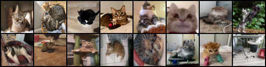

*Training cats after preprocessing*

---

## Models

| Model | Generation path | Latent | Params |
|-------|-----------------|--------|--------|
| **DCGAN** | random **z** → generator → image; discriminator judges real/fake | Continuous **z** | ~9.6M |
| **AAE** | image → encoder → **z** → decoder; latent discriminator regularizes **z** | Continuous **z** | ~7.7M |
| **VQ-VAE** | image → encoder → codebook → decoder; generation samples code indices | Discrete codes | ~0.5M |

---

<!-- _class: content -->

## Training objectives

| Model | Optimized losses | Purpose |
|---|---|---|
| **DCGAN** | discriminator BCE + generator non-saturating BCE | generate images that look real to D |
| **AAE** | reconstruction MSE + latent discriminator BCE + encoder adversarial BCE | reconstruct images and keep **z** sampleable |
| **VQ-VAE** | reconstruction MSE + vector-quantization commitment loss | reconstruct through a stable discrete codebook |

- DCGAN uses label smoothing on real discriminator targets in selected runs
- AAE regularizes the encoded latent distribution toward a Gaussian prior
- VQ-VAE generation samples discrete codes from empirical training-code frequencies

---

<!-- _class: content -->

## Part A — What we tried (64×64)

- **Sweep:** ~10 configs per family (z, lr, codebook K) on **1500** train cats
- Varied: latent size, learning rate, codebook size, generator upsampling, label smoothing
- **Refine:** 80 epochs, best configs per family; DCGAN used upsample+conv G and separate G/D LR
- Takeaway: broad sweep identified DCGAN as best FID model, but visual quality stayed weak

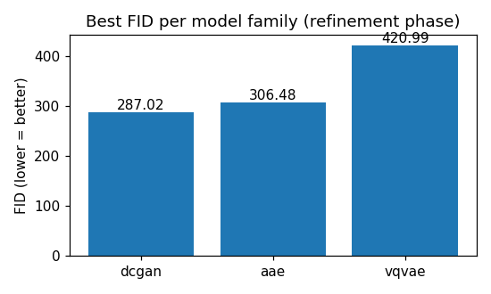

---

<!-- _class: figure -->

## Part A — Sample grids (64×64, eval)

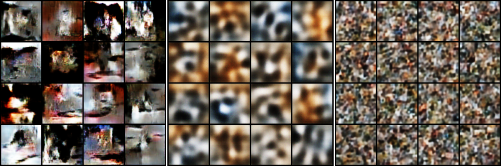

<b>DCGAN</b> FID 287.024
<b>AAE</b> FID 306.485
<b>VQ-VAE</b> FID 420.992

---

<!-- _class: content -->

## Part A — Outcome

| Model | Best refined FID ↓ | Visual outcome |
|---|---:|---|
| **DCGAN** | **287.024** | most structured, still noisy |
| **AAE** | 306.485 | smoother, less realistic |
| **VQ-VAE** | 420.992 | weakest distribution match |

- **Conclusion:** 64×64 was useful for model selection, but not enough for convincing cat images

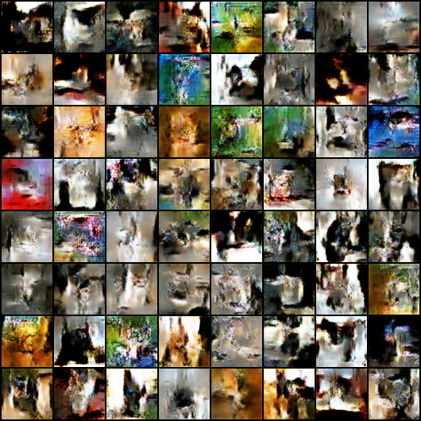

---

<!-- _class: content -->

## Part B — 128×128, 3000 cats

- Models retrained at **128×128**: **DCGAN**, **AAE**, **VQ-VAE**
- Training split: **3000** cat images
- Training augmentation: `RandomResizedCrop` + horizontal flip
- Evaluation: FID computed against **1000** held-out reference cats
- Takeaway: increasing resolution and data improved DCGAN most clearly

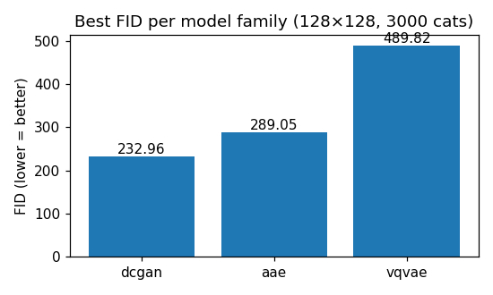

---

<!-- _class: figure -->

## Part B — Sample grids (128×128, eval)

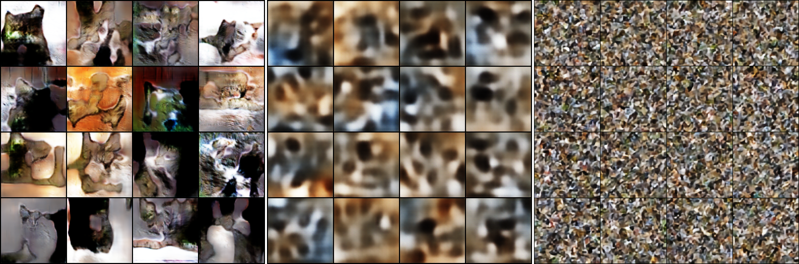

<b>DCGAN</b> FID 232.964
<b>AAE</b> FID 289.050
<b>VQ-VAE</b> FID 489.819

---

<!-- _class: content -->

## Part B — DCGAN @ 128×128

**Best 128×128 result:** DCGAN, FID **232.964**

Samples become more cat-like than at 64×64, but faces and textures remain distorted.

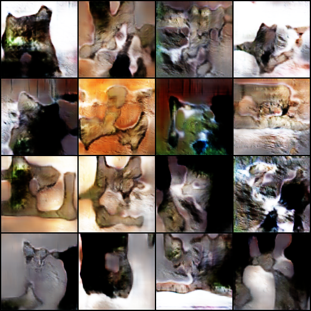

---

<!-- _class: pair -->

## Part B — Latent interpolation

Interpolation checks whether the latent space changes smoothly; it is not a substitute for FID or sample quality.

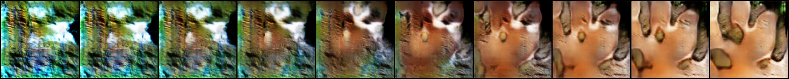

**DCGAN @ 128×128**

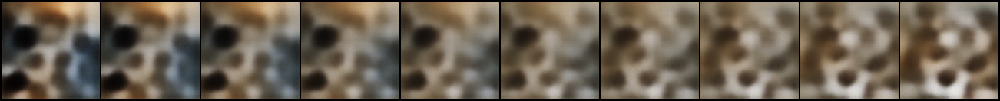

**AAE @ 128×128**

---

<!-- _class: figure -->

## Part B — Cats vs dogs (best model)

Question: does mixed cats+dogs training improve robustness, or does it dilute cat generation? Same DCGAN architecture.

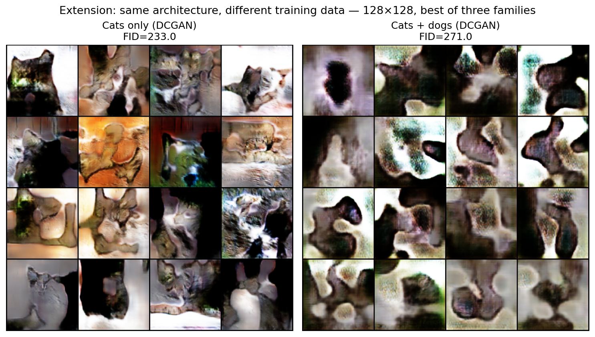

---

<!-- _class: content -->

## Part C — G/D rebalance @128

Phase B DCGAN showed a **generator-loss plateau**, suggesting D was too strong. Part C rebalanced G vs D on the same 3000-cat split for 80 epochs.

| | Phase B | Part C |
|---|---------|--------|
| `lr` (G) | 1e-4 | **2e-4** |
| `lr_d` | 2e-4 | **1e-4** |
| `label_smooth` | 0.1 | **0.05** |

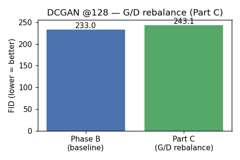

**FID: 232.964 → 243.147** — rebalance did **not** improve on Phase B

---

<!-- _class: figure -->

## Part C — Baseline vs rebalance (eval samples)

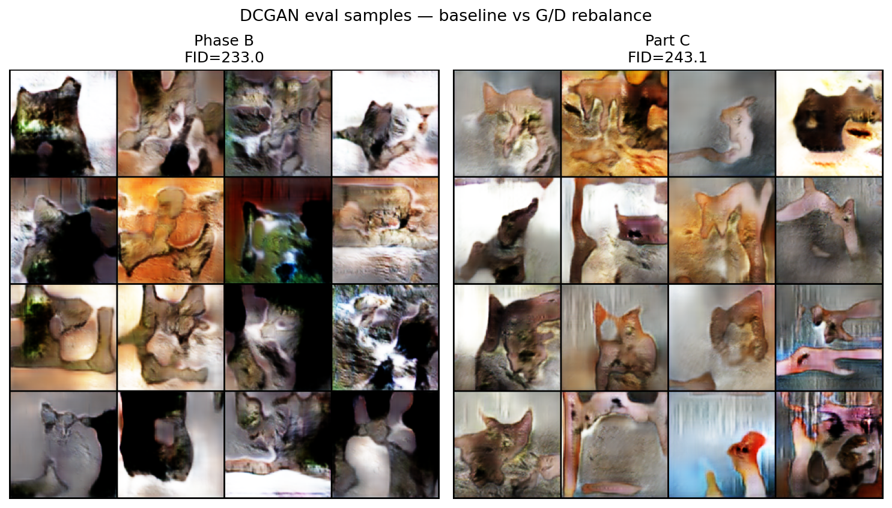

<b>Baseline DCGAN</b> FID 232.964
<b>Rebalanced DCGAN</b> FID 243.147

Same data split and architecture family; only the G/D balance was changed.

---

<!-- _class: content -->

## Learning curves — DCGAN

Adversarial losses are diagnostic rather than direct image-quality objectives. The plateau motivated the Part C G/D rebalance.

---

<!-- _class: content -->

## Learning curves — AAE

AAE optimizes reconstruction while an adversarial latent discriminator pushes encoded latents toward the Gaussian prior.

---

<!-- _class: content -->

## Learning curves — VQ-VAE

VQ-VAE optimizes reconstruction and codebook commitment; low sample diversity suggests empirical code sampling is weak.

---

<!-- _class: content -->

## Quality diagnostics @128×128

Single-run diagnostics from <code>eval/quality.json</code>; μ±σ is over generated samples/features, not repeated seeds.

| Model | FID ↓ | Sharpness sample μ±σ | Diversity sample μ±σ | NN mean |
|---|---:|---:|---:|---:|
| **DCGAN** | **232.964** | 0.0169±0.0083 | **18.493±1.736** | 17.062 |
| **AAE** | 289.050 | 0.0087±0.0024 | 16.075±2.154 | 16.962 |
| **VQ-VAE** | 489.819 | **0.0178±0.0010** | 9.590±1.800 | 17.245 |

- **Interpretation:** DCGAN has the best FID and highest diversity; VQ-VAE is sharp by this statistic but much less diverse
- Sharpness: Laplacian variance over generated samples
- Diversity: mean pairwise Inception-feature distance
- NN mean: nearest-neighbor distance to training references in Inception space

---

## Conclusions

| Phase | Best model | Best cats FID |
|-------|------------|---------------|
| 64×64 refine | DCGAN | 287.024 |
| 128×128 | DCGAN | **232.964** |
| 128×128 G/D rebalance | DCGAN | 243.147 |

1. **DCGAN** wins across phases (AAE/VQ-VAE higher FID)
2. **64×64 sweep + refine** = fair comparison, **not** good visuals
3. **128×128 + more data** = clear improvement
4. **G/D rebalance** did not beat Phase B — simple LR/smoothing tweak insufficient

---

## Limitations

- Small **custom** nets — not StyleGAN / diffusion
- **FID not comparable** across 64 vs 128 (different resolution & splits)
- **FID-only** — no human study; **VQ-VAE** has no latent interpolation in our pipeline
- No repeated seeded trials, so FID has no confidence interval here
- Cats-vs-dogs extension only for **best** model at 128; Part A used smaller data splits

---

<!-- _class: lead -->

# Thank you

[github.com/AdamKaniasty/DeepLearningCatGen](https://github.com/AdamKaniasty/DeepLearningCatGen)
